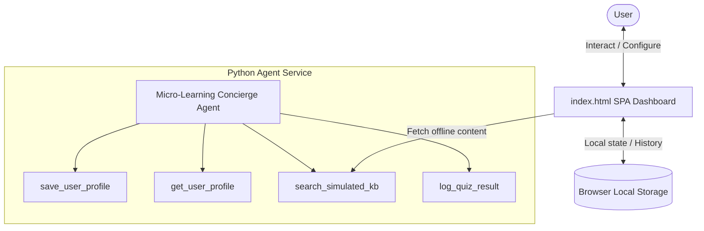

# Micro-Learning Concierge

A personalized educational concierge agent that curates custom, 5-minute daily lessons based on learning goals, schedules daily deliveries, and conducts interactive quizzes to test comprehension.

## Prerequisites
* **Python:** Python 3.11+ (Python 3.14 recommended)
* **Package Manager:** `uv` (Fast Python package installer)
* **API Credentials:** Gemini API Key from [Google AI Studio](https://aistudio.google.com/apikey)

## Quick Start
```bash
# Clone the repository
git clone <repo-url>
cd micro-learn-concierge

# Set up environment variables
cp .env.example .env  # Add your GOOGLE_API_KEY to the .env file

# Install dependencies and local packages
make install

# Launch the interactive local dashboard UI
open app/index.html
```

## Architecture Diagram


## How to Run & Test
* **Interactive UI Dashboard:** Open [app/index.html](file:///Users/dineshg/Downloads/adk-workspace/micro-learn-concierge/app/index.html) directly in your browser.
* **Run Unit Tests:** Run `make test` or `.venv/bin/pytest tests/unit/test_agent.py` to execute the local Python agent validation test suite.

## Sample Test Cases
1. **Setting Goals & Schedule:**
   * **Input:** In the sidebar, select **Quantum Computing** as the topic, set delivery to **09:00 AM**, and click **Update Profile**.
   * **Expected:** Preferences are saved in the user's profile state.
   * **Check:** The dashboard sidebar updates the profile status: `Active Goal: Quantum Computing` and `Daily Time: 09:00 AM`.
2. **Requesting a Lesson:**
   * **Input:** Click **Request Today's Lesson**.
   * **Expected:** The concierge retrieves the curated outline on "Quantum Computing" and formats a 5-minute read.
   * **Check:** The main workspace loads the lesson card titled "Quantum Computing: Introduction to Qubits" along with a 3-question interactive multiple-choice quiz.
3. **Taking the Quiz:**
   * **Input:** Select options **B** (Superposition) for Q1, **A** (Spooky action) for Q2, **C** (Interference) for Q3, and click **Submit Quiz answers**.
   * **Expected:** The quiz grades the answers, displays explanations, and appends the result to the history.
   * **Check:** The score banner displays `"You scored 3/3!"` and the **Quiz Performance** history list updates in the sidebar.

## Troubleshooting
1. **`PermissionError: [Errno 1] Operation not permitted: '.agents/skills'`:**
   * **Cause:** The `agents-cli` framework attempts to check user-global skill directories which are outside the sandboxed workspace.
   * **Fix:** Ensure the command is executed with `HOME=/Users/dineshg/Downloads/adk-workspace` set.
2. **`ImportError: cannot import name 'logging' from 'google.cloud'`:**
   * **Cause:** The `google-cloud-logging` package is missing in the Python environment.
   * **Fix:** Run `make install` or `uv pip install --offline google-cloud-logging` to verify all required dependencies are synchronized.
3. **Uvicorn Bind Port Error (`[errno 1] operation not permitted`):**
   * **Cause:** Direct socket port binding is blocked by container sandbox security rules.
   * **Fix:** Test the interface by opening the static [app/index.html](file:///Users/dineshg/Downloads/adk-workspace/micro-learn-concierge/app/index.html) file directly in your web browser.

## Push to GitHub

1. Create a new repo at https://github.com/new
   - Name: micro-learn-concierge
   - Visibility: Public or Private
   - Do NOT initialize with README (you already have one)

2. In your terminal, navigate into your project folder:
   ```bash
   cd micro-learn-concierge
   git init
   git add .
   git commit -m "Initial commit: micro-learn-concierge ADK agent"
   git branch -M main
   git remote add origin https://github.com/DineshGunasekaran14/micro-learn-concierge.git
   git push -u origin main
   ```

3. Verify .gitignore includes:
   ```
   .env          ← your API key — must NEVER be pushed
   .venv/
   __pycache__/
   *.pyc
   .adk/
   ```

   ⚠ NEVER push .env to GitHub. Your API key will be exposed publicly.
