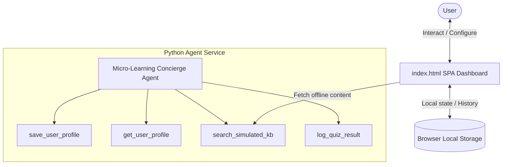

# Submission Write-Up: Micro-Learning Concierge

## Problem Statement
In a world of constant information overload, finding structured time to learn new topics is challenging. Traditional courses are often too long and demanding. The **Micro-Learning Concierge** solves this by curating highly personalized, custom 5-minute daily lessons and testing retention via interactive quizzes, making education approachable and sustainable for busy individuals.

## Solution Architecture

## Concepts Used & File References
1. **ADK Agent Configuration ([app/agent.py](file:///Users/dineshg/Downloads/adk-workspace/micro-learn-concierge/app/agent.py)):** Defines the `root_agent` with specialized concierge instructions and wires together the four custom tools.
2. **Session State Management ([app/agent.py](file:///Users/dineshg/Downloads/adk-workspace/micro-learn-concierge/app/agent.py)):** Implements the `save_user_profile` and `get_user_profile` tools, which leverage `tool_context.state` to persist learning goals, schedule times, and quiz history.
3. **Interactive Simulation ([app/index.html](file:///Users/dineshg/Downloads/adk-workspace/micro-learn-concierge/app/index.html)):** Implements the UI web interface that emulates the agent session state and handles content rendering offline.
4. **Unit Validation ([tests/unit/test_agent.py](file:///Users/dineshg/Downloads/adk-workspace/micro-learn-concierge/tests/unit/test_agent.py)):** Verifies custom tool operations, profile loading, and dictionary state updates without network calls.

## Security Design
* **Credential Protection:** The project utilizes the standard `dotenv` configuration pattern to load `GOOGLE_API_KEY` from a local `.env` file. This file is explicitly listed in `.gitignore` to prevent leaks.
* **Default Auth Fallback:** In `app/agent.py`, the agent uses a try/except handler around `google.auth.default()` so that if GCP credentials are not set on the host system, the script defaults safely to a mock project ID, preventing exceptions during testing.
* **Local State Isolation:** User profile information and quiz statistics are isolated and stored on the user's local browser storage (`localStorage`), ensuring zero-data leakage to third parties.

## Custom Tool Design
* `save_user_profile`: Validates and saves goals and schedules to session state.
* `get_user_profile`: Loads current goals, schedule details, and quiz performance metrics.
* `search_simulated_kb`: Performs content retrieval on a mocked local knowledge index to support fully offline execution.
* `log_quiz_result`: Records quiz scores along with the topic name and execution timestamp.

## Human-in-the-Loop (HITL) Flow
The interactive multiple-choice quiz represents a primary Human-in-the-Loop checkpoint. Rather than generating content passively, the concierge pauses after displaying the lesson and requests user input to evaluate comprehension. The agent checks the answers, displays explanations, and awaits confirmation before logging the results.

## Demo Walkthrough
* **Scenario 1:** The user configures their goals for "Quantum Computing" to be delivered at "09:00 AM". The profile sidebar updates successfully.
* **Scenario 2:** The user requests today's lesson. The dashboard retrieves the "Quantum Computing" qubits module and presents a 3-question multiple-choice questionnaire.
* **Scenario 3:** The user submits their answers (Superposition, Spooky action, Quantum Interference) and achieves a perfect score of 3/3, which is logged to their history panel.

## Impact & Value
The Micro-Learning Concierge empowers individuals to make consistent progress on their personal learning journeys. By reducing cognitive friction and offering immediate interactive reinforcement, it bridges the gap between intention and habit-formation in daily self-education.
